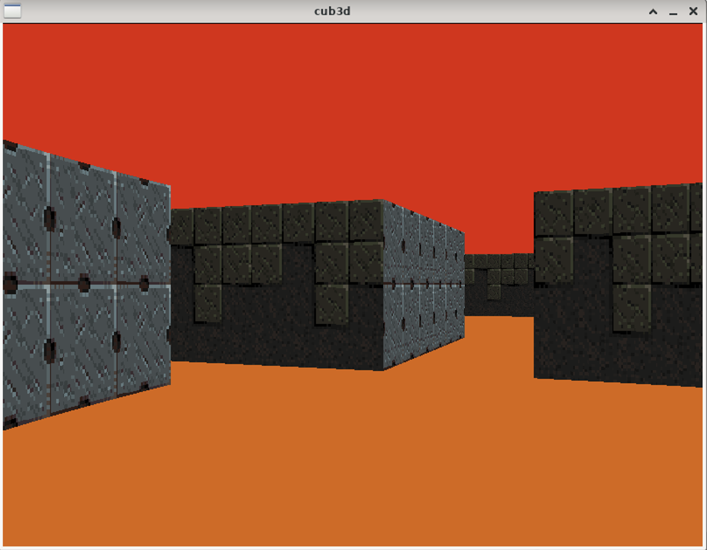
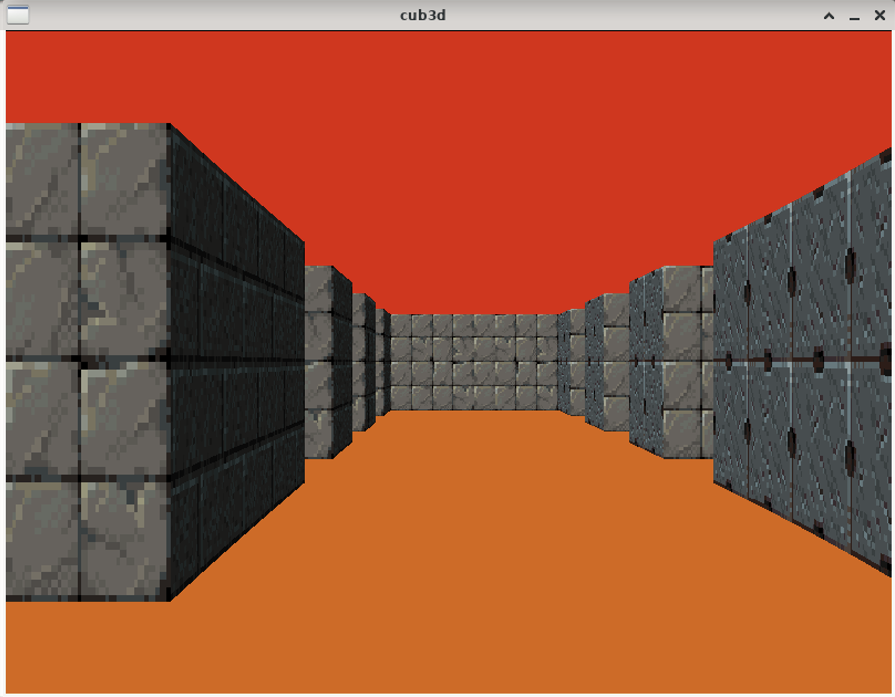
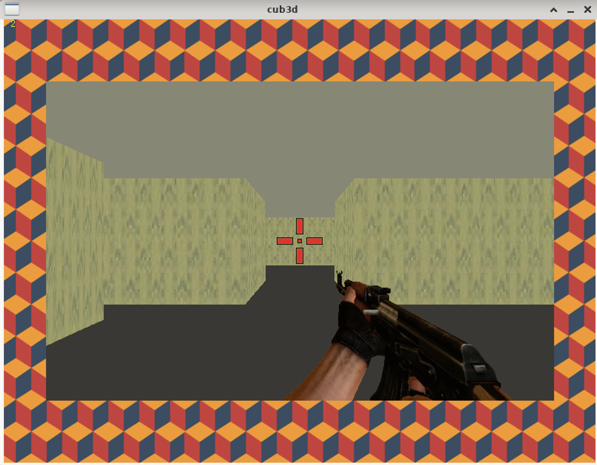
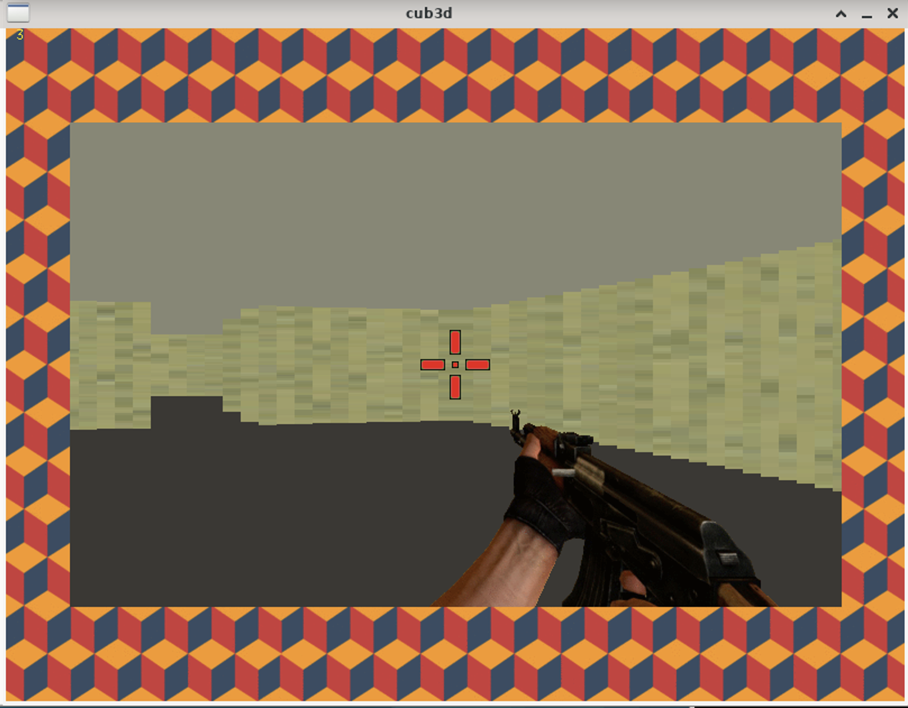

# Cub3D


Bienvenue sur le projet **Cub3D**, une interprétation moderne et minimaliste inspirée du célèbre Wolfenstein 3D. Ce projet met en œuvre les bases du ray-casting pour créer une représentation graphique immersive d'un labyrinthe en 3D.


## Aperçu

Cub3D explore des concepts de programmation graphique, d'optimisation et de conception logicielle. C'est un moteur graphique dont le but est de proposer un jeu en vue subjective, où l'utilisateur navigue dans un labyrinthe.


## Objectif du Projet

Le but principal est de créer une vue subjective dynamique d'un labyrinthe en utilisant la technique du ray-casting. Pour se faire :
- Parser un fichier de description (.cub) pour charger une carte.
- Afficher une scène en 3D "réaliste" en fonction des éléments de la carte.
- Gérer les interactions utilisateur pour explorer le labyrinthe.


## Fonctionnalités Implémentées

- **Graphismes 3D** : Afficher une scène 3D en utilisant la MiniLibX.
- **Textures et couleurs** : Gérer des textures différentes pour les murs (nord, sud, est, ouest) ainsi que des couleurs distinctes pour le sol et le plafond.
- **Interactions utilisateur** :
  - Déplacement avec les touches W, A, S, D.
  - Rotation de la caméra avec les flèches gauche et droite.
  - Fermeture du programme avec la touche ESC ou la croix de la fenêtre.
- **Parsing** : Valider et interpréter un fichier de description conforme.

## Exigences Techniques

- **Langage** : C, respectant la [Norme 42](https://github.com/42School/norminette).
- **Fonctions autorisées** : open, close, read, write, printf, malloc, free, perror, strerror, exit, ainsi que les fonctions de la lib math (-lm) et de la MiniLibX.
- **Makefile** : Comprend les règles `all`, `clean`, `fclean`, `re`, et `bonus`.
- **Gestion de la mémoire** : Aucune fuite mémoire tolérée.


## Installation

### Prérequis

- gcc / clang
- Make

### Compilation

Librairie graphique (mlx):
```sh
cd ./mlx/
make re
```
Projet
```sh
make
```


### usage

```sh
./cub3D maps/example.cub
```

Des cartes sont fournis dans `./maps/`

## Notre projet de base





### Exemple de fichier .cub :
```
NO ./path_to_the_north_texture
SO ./path_to_the_south_texture
WE ./path_to_the_west_texture
EA ./path_to_the_east_texture

F 220,100,0
C 225,30,0

111111
100101
101001
1100N1
111111
```


## Bonus réalisés

- Changement qualité des graphique en temps réel
- Gestion des collisions
- HUD minimaliste (Crosshait, arme, contour)
- Compteur IPS actif

### Notre implémentation de bonus



Visualisation de l'optimisation des graphiques sur la capture 2



## Documentation

Le sujet du projet [fr.sujet.cub3d.pdf](docs/fr.sujet.cub3d.pdf)


## Auteurs

Projet réalisé par :
- [kscarmy](https://github.com/kscarmy)
- [mourdani](https://github.com/mourdani)